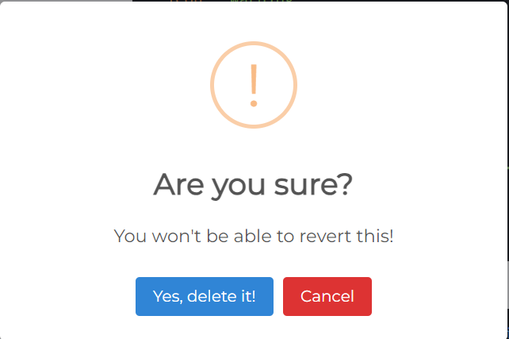
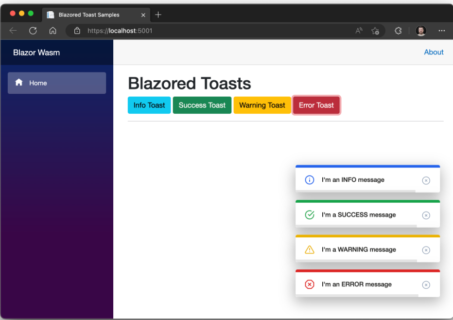
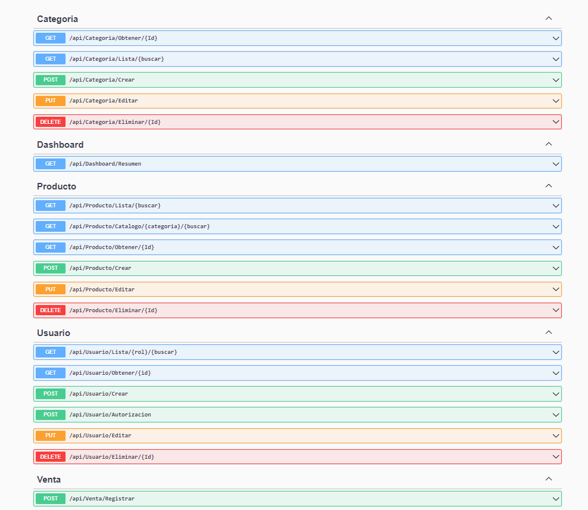

# **Proyecto BackEnd**

## Descripción del Proyecto

La presente aplicación fue realizada en Visual Studio 2022, utilizando la tecnología .net core 7.0, con los los proyectos de Blazor (Aplicación en Webassembly), también tiene su Proyecto API () y otras bibliotecas que ayudan al traspaso de información sin tener que exponer los datos de la Base en el FrontEnd.

En el presente proyecto, se realiza la muestra de una aplicación simulando una tienda de artículos, se tiene los siguientes roles de prueba:

| IdUsuario | NombreCompleto | Correo            | Clave | Rol           |
|-----------|----------------|-------------------|-------|---------------|
| 1         | Admin          | admin@gmail.com   | admin | Administrador |
| 5         | cliente        | cliente@gmail.com | 123   | Cliente       |

Se puede hacer el CRUD en todas las tablas, Usuario, Categorías, Productos. Para un correcto funcionamiento de la aplicación se deja el archivo backend.bak[banckend.bak](README/backend.bak), dentro de la carpeta README. La base de datos backend fue realizada en sqlserver versión 18.11.1.

## Funcionalidades De la aplicación BackEnd

### Pantalla de Inicio
En ella se ingresa sólo al catalogo de productos el cual tiene un filtro para buscar por categorías y un buscador. Para poder comprar un articulo el cliente deberá iniciar sesión.

![Pantalla 1]

### Pantalla Login
En ella se podrá ingresar como administrador o como cliente, además el cliente podrá registrarse, para poder realizar su compra.

### Pantalla Cliente
Como cliente se podrá comprar los artículos del catálogo, se hace una compra ficticia, para simular que un cliente puede ingresar datos de su tarjeta y realizar su compra. En el carro de comprar Cart, podrá eliminar los productos escogidos y aumentar o disminuir la cantidad.

### Pantalla Admin
En esta pantalla, al ingresar con el usuario **admin@gmail.com** y clave **admin**, el usuario podrá ver varias pantallas:
#### Dashboard
En la cual se muestran la cantidad de ventas, el total de productos, total de ingresos y los clientes que se tienen registrados.

#### Usuarios
En esta pantalla se podrán ingresar nuevos usuarios, editarlos y eliminarlos.

#### Categorías
En esta pantalla se muestran las categorías creadas las cuales pueden ser editadas y se pueden crear nuevas categorías.

#### Productos
En esta pantalla se pueden agregar, editar o eliminar productos y se ven los productos en su totalidad, con un input para buscarlos, en esta pantalla a diferencia de la pantalla catálogo no se tiene un radio button para seleccionar categorías.

#### Catálogo
Esta es la pantalla de inicio de la aplicación, cuando no existe ningún usuario registrado, en ella se pueden ver todos los productos y se puede filtrar o buscar un producto.

#### Otras Pantallas
Al hacer click en un producto se mostrará una página con los detalles del producto, imagen, precio y se podrá agregar al carro de compras (cart).
#### Otras Funcionalidades
Se muestran mensajes y alertas un poco más amigables con el usuario, usando Nugets como ser Sweetalert2 [https://sweetalert2.github.io/](https://sweetalert2.github.io/)

También se utiliza Blazored.Toast, para mostrar alertas mas novedosas. [https://github.com/Blazored/Toast](https://github.com/Blazored/Toast)

Por otro lado y no menos importante se tiene el proyecto de api, que se realiza con swagger, esta tecnología está incluida en los proyectos API de Microsoft, por lo que es muy fácil su construcción, teniendo una base de datos o entidades bien definidas.
[https://swagger.io/](https://swagger.io/)

#### Posible Mejora
Se intentó usar QuickGrid [https://aspnet.github.io/quickgridsamples/](https://aspnet.github.io/quickgridsamples/), para una forma de generar tablas de manera mucho más vistosa, pero no fue posible la correcta configuración entonces se decidió dejar pendiente esa mejora.

## Autor del proyecto

Jaime Enrique Dávila Zuazo

